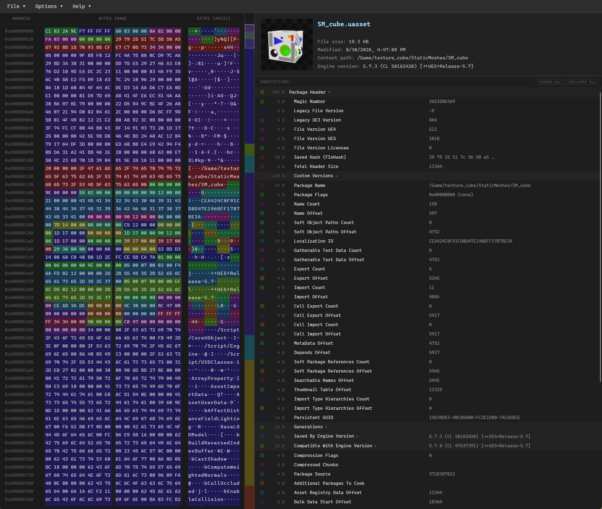

Some months ago I vibe-coded a browser-based Unreal Engine asset viewer and forgot to publish or mention it anywhere. I thought it was pretty interesting to see how the bytes are actually laid out on the file.

You can try it out **[here](https://1danielcoelho.github.io/uassets/)**. It contains some sample assets as well so you don't need any .uasset ready on your end.

Here is what it looks like:

It parses `.uasset` and `.umap` files, shows you the raw bytes, parses values and describes what the fields mean.

It's purely client-side: The file never leaves your machine and nothing is uploaded anywhere.

It should work for most UE 5.x assets and some 4.x assets, with some luck!

## Features

- **Hex viewer**: Every byte of the file, with color-coded ranges marking what each region actually is. Canvas-based with virtual scrolling, so large assets stay smooth.
- **Annotations panel**: A collapsible tree of named byte ranges, each with its size, name, and parsed value. This is the part that replaces the manual byte-counting.
- **Summary panel**: Asset class, engine version, package path, and the embedded thumbnail if the asset has one.
- **Minimap**: A proportional overview of the whole file with a viewport indicator, which turns out to be a surprisingly good way to get a feel for how an asset is laid out.
- **Search**: By hex bytes, ASCII text, byte address, or annotation name (`Ctrl+F` / `Ctrl+G`).
- **Context menus**: Copy the address, the raw bytes, or the ASCII text of any annotated region, and scroll the other views to match where you clicked

## Limitations

- **Properties**: It should display some types of serialized property values but not all, and also won't handle nested structs super well.

It's open source and hosted on Github [here](https://github.com/1danielcoelho/uassets).

Cheers!
